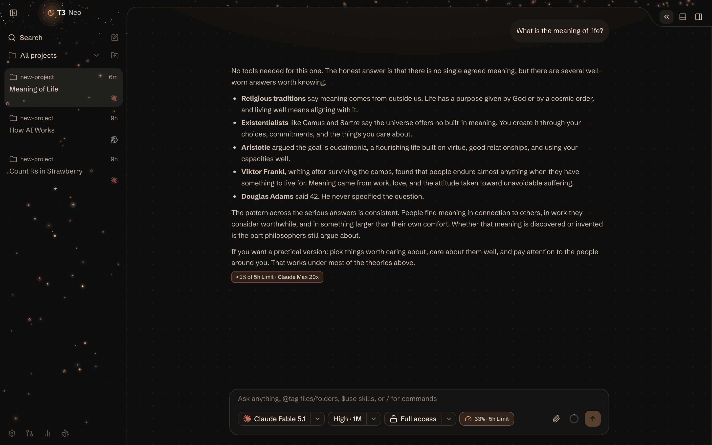
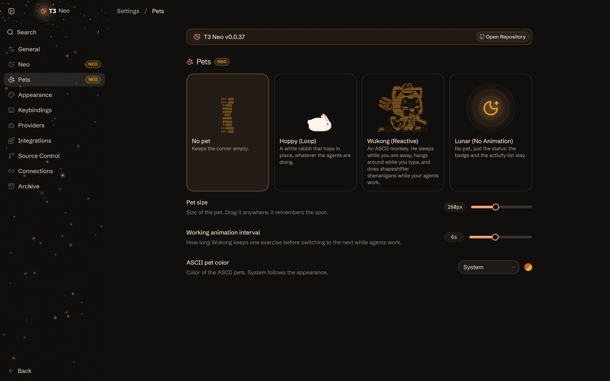

# T3 Neo

<p>
  <a href="https://xibn.github.io/t3neo/download/"></a>
</p>

A fork of [T3 Code](https://github.com/pingdotgg/t3code) that follows every stable upstream release and adds:

- **Neo look.** Warm amber palette, flat bordered surfaces, pill controls, a star sky over sidebar and top bar. On by default; the standard look stays selectable.
- **Message queue.** Messages sent during a running turn wait and start their own turn afterwards. Send now steers instead. Per-message edit, reorder, discard, retry.
- **Usage badges.** Every finished turn shows its share of your plan window, or the billed cost. The composer pill shows the tightest limit and opens plan, last turn, and month-to-date.
- **Collapsible header.** One button folds the header actions away into a slim bar with a rounded workspace below.
- **Pets.** Hoppy, Wukong the reactive ASCII monkey, or a still Lunar badge. Running-thread count, unseen-completion marker, activity list, optional floating desktop window.
- **Neo settings.** Toggles for all of the above, chevron animations, ASCII color, branch manager position, default context window and fast mode, in-place desktop updates, and more.

## Screenshots





---

# T3 Code

T3 Code is an "agent harness control surface". It enables control of the agents on your machine with a best-in-class mobile app ([iOS](https://apps.apple.com/us/app/t3-code-remote-claude-more/id6787819824), [Android](https://play.google.com/store/apps/details?id=com.t3tools.t3code)), [web app](https://app.t3.codes) and [Electron-based desktop app](https://t3.codes).

Works with your subscriptions on Claude Code, Codex, Cursor, Grok Build, and OpenCode. If they're set up on your computer, T3 Code can control them.

## "Wait, what are you selling me?"

Nothing. We built T3 Code because we wanted the best possible development experience with agents. We were inspired by existing solutions like the Codex desktop app, Conductor, Claude Desktop and Cursor Glass, but none met our bar.

We wanted something performant, remote-ready, and truly open. If we ever go the wrong direction, we want you to have everything you need to fork and build the editor that you want.

## Installation

> [!WARNING]
> T3 Code currently supports Codex, Claude, Cursor, Grok Build and OpenCode. Install and authenticate at least one provider before use:
>
> - Codex: install [Codex CLI](https://developers.openai.com/codex/cli) and run `codex login`
> - Claude: install [Claude Code](https://claude.com/product/claude-code) and run `claude auth login`
> - Cursor: install [Cursor CLI](https://cursor.com/cli) and run `agent login`
> - Grok Build: install [Grok Build CLI](https://x.ai/cli) and run `grok login`
> - OpenCode: install [OpenCode](https://opencode.ai) and run `opencode auth login`

### Try it out (install-free)

The easiest way to test T3 Code is to run the server in your terminal (requires Node.js 22.16+, 23.11+, or 24.10+):

```bash
npx t3@latest
```

This will launch T3 Code's backend on your machine as well as the local web app to control your agents.

Tip: Use `npx t3@latest --help` for the full CLI reference.

### Desktop app

Install the latest version of the desktop app from [GitHub Releases](https://github.com/pingdotgg/t3code/releases), or from your favorite package registry:

#### Windows (`winget`)

```bash
winget install T3Tools.T3Code
```

#### macOS (Homebrew)

```bash
brew install --cask t3-code
```

#### Arch Linux (AUR)

Stable:

```bash
yay -S t3code-bin
```

Nightly:

```bash
yay -S t3code-nightly-bin
```

The AUR packaging is maintained in this repository under [`packaging/aur`](./packaging/aur).

## Some notes

We are very very early in this project. Expect bugs.

We are (mostly) not accepting contributions yet. Small fixes may be considered. Big features will not be.

## Documentation

Full docs live in [docs/](./docs). There's no docs site yet.

- [Install and first run](./docs/user/install.md)
- [Permission modes](./docs/user/permission-modes.md)
- [Keyboard shortcuts](./docs/user/keybindings.md)
- [Customize a project icon](./docs/user/project-settings.md)
- [Remote access from a phone or another machine](./docs/user/remote-access.md)
- [Keeping app and server in sync](./docs/user/updating.md)
- [Source control integrations](./docs/user/source-control.md)
- Multiple accounts: [Codex](./docs/user/providers-codex.md) · [Claude](./docs/user/providers-claude.md)
- Linux: [run T3 Code as a background service](./docs/user/background-service.md)

Building from source? Start at [docs/internals/overview.md](./docs/internals/overview.md).

## If you REALLY want to contribute still.... read this first

### Install `vp`

T3 Code uses Vite+ so you'll need to install the global `vp` command-line tool.

#### macOS / Linux

```bash
curl -fsSL https://vite.plus | bash
```

#### Windows

```bash
irm https://vite.plus/ps1 | iex
```

Checkout their getting started guide for more information: https://viteplus.dev/guide/

### Install dependencies

```bash
vp i
```

Read [CONTRIBUTING.md](./CONTRIBUTING.md) before reporting a bug or opening a PR.

Have a feature request? Start an [Ideas discussion](https://github.com/pingdotgg/t3code/discussions/categories/ideas).

Need support? Join the [Discord](https://discord.gg/jn4EGJjrvv).
